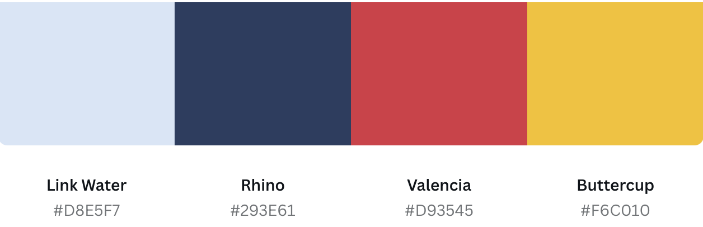
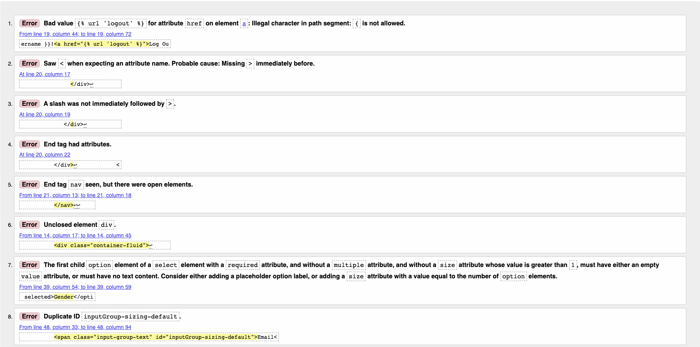
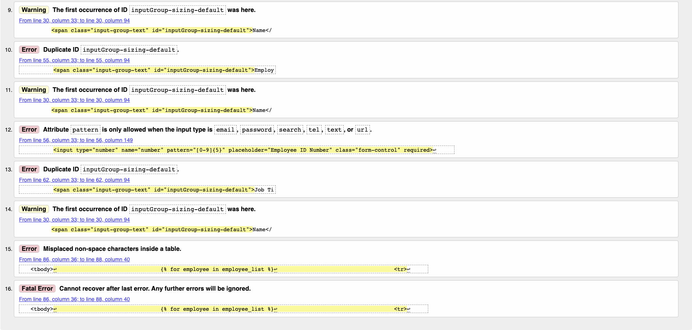
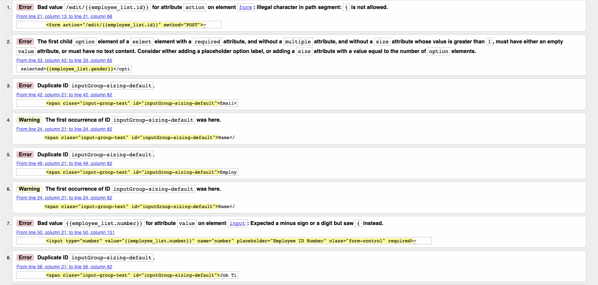
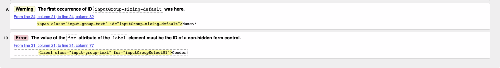
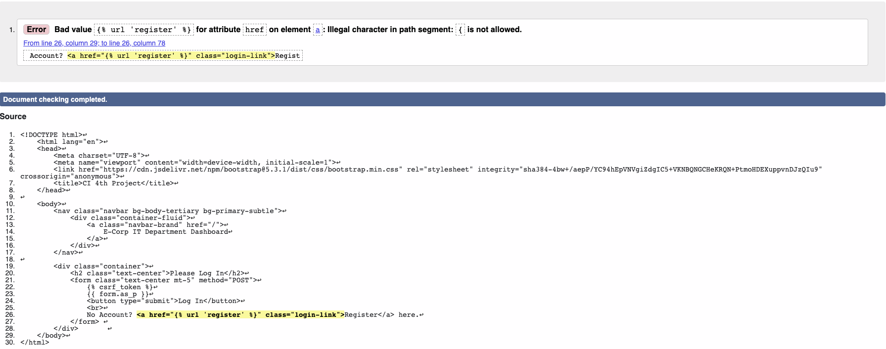
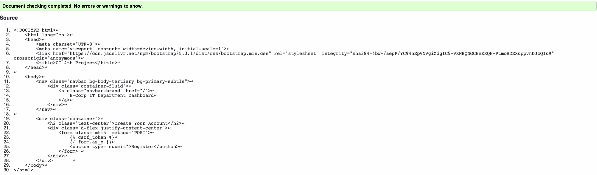
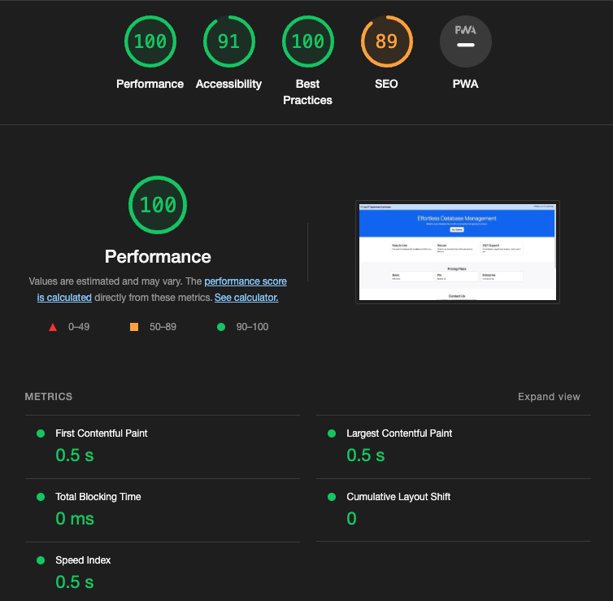
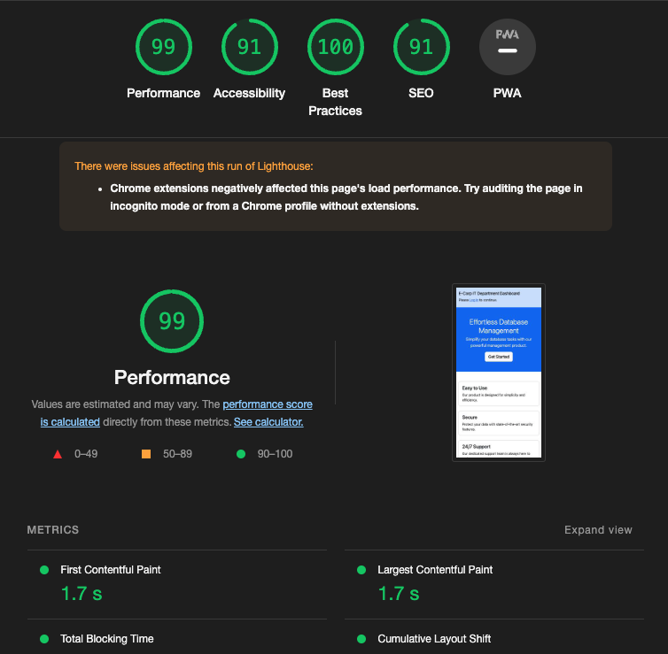

# E-Corp Employee Dashboard

For the 4th Project of the Code Institute Course, I decided to make a Dashboard for all Employees of the E-Corp IT Department. The inspiration of E-Corp came from the Prime Series called "Mr. Robot". We can see the current employees in the IT Department whilst being to manipulate their data at the same time.

Please find the live project [here:](https://github.com/Retr01234/django_employee_dashboard) 

---

## Table Of Contents

* [User Experience (UX)](#User-Experience-(UX))
  * [Initial Discussion](#Initial-Discussion)
  * [User Stories](#User-Stories)
* [Features](#features "Features")
* [External Sources Used](#external-sources-used "External Sources Used")  
* [Python Libraries Used](#python-libraries-used "Python Libraries Used")  
* [Testing](#testing "Testing")
* [Bugs and Solutions](#bugs-and-solutions "Bugs and Solutions")
* [Development and Deployment](#development-and-deployment "Development and Deployment")
* [Credits](#Credits "Credits")

---

## User Experience (UX)

### Initial Discussion

E-Corp Employee Dashboard is a simple Dashboard Application that allows users(site admins) to see and edit the current members of staff in the IT-Department. This website is not made for just any normal user to log in and start manipulating data. This is an internal product created by the Engineers from the the Company "E-Corp" that is used to manage their IT Department Employee Tables. So, only E-Corp IT System Administrators can create accounts and add, delete and or make changes to their IT Department Staff.

#### Key information for the site

* Who are the current employees in the IT Department?
* Can I add new members to the IT Team?
* Can I change the employees details?
* Can I remove one or more employees from the List?
* Product is only for E-Corp IT Admins

### User Stories

#### User Goals

* To be able to view the site on a range of device sizes.
* To make changes to the Employees details very fast and easy.
* To edit the Employee List any time I want.
* To help potential new Users understand the system better.

## Design

### Colour Scheme
The colour palette was created using the [Canva](https://www.canva.com/colors/color-palette-generator/) website.

### Typography

Bootstrap v5.3.1 was used for all fonts in this Application.

### Imagery

No Images were used in the Production of this Project.

## Features

This website contains 4 Pages and that is the Home Page, Edit Page, Login and Register Page. The Home and Edit page are only accessible if the User has logged in.

* Home Page:
  * Header
  * Add Employee(s)
  * See Current Employees

* Edit Page:
  * Header
  * Edit Formula

* Login Page:
  * Login Form (Username + Password)

* Register Page:
  * Register Form (Username, Password, Repeat Password)

### Accessibility
I have been mindful during coding to ensure that the website is as accessible friendly as possible. I have achieved this by:

* Using well structured HTML.
* Using Bootstrap to help aid with the UI/UX.
* Making the Website fully responsive.
* Ensuring that the website is fully functional as well as being nice to look at.
* Making the App very User Friendly even for Non-Technical People.

---

## Technologies Used
### Languages Used
* HTML was used to create the Templating
* Python was used to create the entire app logic

### Frameworks, Libraries & Programs Used
* Django - Main focus and used as backend framework to create functionality and features.
* Bootstrap - Using Colors, CSS Classes and Fonts to make the website pretty and responsive.
* SQL - For saving User Data
* [Am I Responsive?](http://ami.responsivedesign.is/) To show the website image on a range of devices.
* Git - For version control.
* Github - To save and store the files for the website.
* Google Dev Tools - To troubleshoot and test features, solve issues with responsiveness and styling.

## Deployment & Local Development

#### Local Deployment  
1. Clone the repository from GitHub by clicking the "Code" button and copying the URL.
2. Open your preferred IDE and open a terminal session in the directory you want to clone the repository to.
3. Type `git clone` followed by the URL you copied in step 1 and press enter.
4. Install the required dependencies by typing `pip install -r requirements.txt` in the terminal.
5. Note: The project is setup to use environment variables. You will need to set these up in your local environment. See [Environment Variables](#environment-variables) for more information.
6. Connect your database of choice and run the migrations by typing `python manage.py migrate` in the terminal.
7. Create a superuser by typing `python manage.py createsuperuser` in the terminal and following the prompts.
8. Optional: Fixtures for Flight, Airport and Aircraft models are included in the project in the `fixtures` directory. To add pre-populated data to the database, run `python manage.py loaddata fixtures/[fixture_name].json`.
9. Run the app by typing `python manage.py runserver` in the terminal and opening the URL in your browser.

#### Heroku Deployment
1. Login to the Heroku dashboard and create a new app.
2. Connect your GitHub repository to your Heroku app.
3. In the Settings tab, ensure that the Python Buildpack is added.
4. Set environment variables in the Config Vars section of the Settings tab.
5. In the Deploy tab, enable automatic deploys from your GitHub repository.
6. Click the "Deploy Branch" button to deploy the app.
7. Once the app has been deployed, click the "Open App" button to view the app.
8. If using S3, you will need to set up an S3 bucket and add the environment variables to your Heroku app (see tutorial [here](https://testdriven.io/blog/storing-django-static-and-media-files-on-amazon-s3/) for reference.)

#### To fork the django_employee_dashboard repository:

1. Log in (or sign up) to Github.
2. Go to the repository for this project, Retr01234/django_employee_dashboard
3. Click the Fork button in the top right corner.

#### How to Clone

To clone the django_employee_dashboard  repository:

1. Log in (or sign up) to GitHub.
2. Go to the repository for this project, Retr01234/django_employee_dashboard
3. Click on the code button, select whether you would like to clone with HTTPS, SSH or GitHub CLI and copy the link shown.
4. Open the terminal in your code editor and change the current working directory to the location you want to use for the cloned directory.
5. Type 'git clone' into the terminal and then paste the link you copied in step 3. Press enter.

## Testing
Testing was conducted very carefully through the entire project. As a heads up, since I had no pure HTML and instead had Django HTML the W3C Validator listed some errors due to the Django Knowledge but does not cause any problems in terms of functionality.

### AUTOMATED TESTING

####  W3C Validator
Again since it wasnt pure HTML these errors are mostly to do with Django Syntax. And both of these files (Base.html & Edit.html) errors were too long to fit in one screenshot, therefore I provided with 2.

##### Home/Main Page (I called it base)

##### Edit Page to edit Employee Information

##### Login Page (To Log In with your Credentials)

##### Register Page (To Log In with your Credentials)

#### Pylint
Python Code was tested using Code Institute's own [Pylinter](https://pep8ci.herokuapp.com/)

##### Models.py

##### urls.py

##### Forms.py

##### Views.py

#### Lighthouse
I tested for everything in Lighthouse:

##### Desktop

##### Mobile

## MANUAL TESTING

### Testing User Stories

| Goals | How are they achieved? | Image |
| :--- | :--- | :--- |
| `First Time Visitors` |
|  |  |  |
| Understand what the product is about and what its trying to sell. | The main landing page gives a brief but detailed information about the product and its advantages. | :--- |
|`Admin User` |
|  |  |  |
| Be able to Log In to their Accounts | Since it is an intern product for System Admins of E-Corp, only they can log in and use the features.  | :--- |
| Be able to create an Account | If the User does not have an account, they will be given an option to do so in the login page. | :--- |
| Create New Staff to the Dasboard | The user has a Form where they have to fill out some informations about the New Employees and once it matches the criteria, they will click Add to add a new Employee. | :--- |
| Edit Staff Details | The user has the option to make changes to the users details with the click of the Edit button. | :--- |
| Delete Staff from the System | The user can literally delete a staff member from the System with a single click on the Delete Button. | :--- |  |

### Full Testing
Full testing was performed on the following devices:

* Laptop:
  * Macbook Air M1 2021 13 inch screen

* Mobile Devices:
  * iPhone 12 Pro
  * iPhone XR
  * iPad Air
  * Samsung Galaxy S20 Ultra

* External Monitors:
  * LG 32 Inch Ultra Wide
  * MSI 24 Inch Gaming Monitor

Each device tested the site using the following browsers:

* Google Chrome
* Safari
* Firefox

`Home/Main Page`

| Feature | Expected Outcome | Testing Performed | Result | Pass/Fail |
| --- | --- | --- | --- | --- |
| Main Header | Directs the user right to the main home page. | Clicked Main Header | Home page reloads | Pass |
| Login Link in the Navbar | Will take the user to Login Page, but also give them the option to register for an account. | Click on Log In text | Login Page will show | Pass |
| Send a Message in the Contact Section | Will not do anything, since its created with Bootstrap and has no functionality. Basically, just for display purposes only. | Fields can be filled out and Button can be clicked | Nothing will happen | Not Pass nor Fail |
| Add, Edit and or Delete Staff from Dashboard | If user is logged in then they will see the Main Dashboard instead of Company Information. And from there, they can change the IT Department Employee List | Forms can be filled out and button will either add new staff, delete current staff or edit current Staff from the List. | Pass |

`Login Page`

| Feature | Expected Outcome | Testing Performed | Result | Pass/Fail |
| --- | --- | --- | --- | --- |
| Username Field | User has to type their Username they created when registering for an account. | Type letters and or numbers in the field | Nothing happens until clicked on Login | Pass |
| Password Field | User has to type their Password they created when registering for an account. | Type letters, numbers and or special characters in the field | Nothing happens until clicked on Login | Pass |
| Login Button | Will check if Username and Password exists and or is correct | Clicking Loggin Button | Will check for username and password in Database, and either direct you to Employee Dashboard or give you an error. | Pass |
| Register Button | Redirects User to Register an Account Page | Clicking Register Button | Will redirect you to the page you can create an account. | Pass | |

`Register Page`

| Feature | Expected Outcome | Testing Performed | Result | Pass/Fail |
| --- | --- | --- | --- | --- |
| Username Field | User must type a Username of their own choice into the Text field. | Type letters and or numbers in the field | Nothing happens until clicked on Register | Pass |
| Password Field | User has to type a Password of their own choice into the Password field. | Type letters, numbers and or special characters in the field | Nothing happens until clicked on Login | Pass |
| Repeat Password Field | User has to re-type the same passsword they typed above in the Password repeat field. | Type same password in the field | Nothing happens until clicked on Login | Pass |
| Register Button | Checks if Username is available and passwords match. | Clicking Register Button | If successful, will automatically log you in and direct you to the Employee Dashboard. If not, it will ask you to fix the errors. | Pass | |

`Edit Page`

| Feature | Expected Outcome | Testing Performed | Result | Pass/Fail |
| --- | --- | --- | --- | --- |
| Edit Form | User can make changes to the same Form as the Add Employee Form e.g. Name, Gender (whatever they choose) | Change current input values | Nothing happens until clicked on Save | Pass |
| Save Button | New editted information will be saved to the System. | Click Save Button | If Input fields match the criteria e.g. A necessary @ symbol in the E-Mail field...New information will be saved and user will be redirected to the Main Dashboard. | Pass | |

## BUGS

### Known Bugs
Currently there are no Bugs and or errors in the Application and the application is working flawlessly.
All Bugs listed below were solved and the page is fully functional and running without any Django and or Console Errors (expect for missing Favicon.ico - but we do not have that).

### Solved Bugs

| No | Bug | How I solved the issue |
| :--- | :--- | :--- |
| 1 | There was a Bug that when a IT Admin clicked on the Delete Button it would delete in the Backend Database but not show in real-time in the Frontend. | As i debugged closer into the code, I realized that I forgot to display the correct paths in the urls.py File. |
| 2 | Edit Button did not redirect to the Edit Form Page | Once I thoroughly checked the Edit Feature, I noticed the Form Method in the HTML File was wrong and then replaced it with the correct Method |
| 3 | Eddited Information would not display in the Dashboard Page | In the views python file I saw that there was no feature to save the actual inputs. But with Djangos own .save() method, it made things easier and fast. |
| 4 | HTML Text Input Fields allowed empty spaces as valid input | With the help of regex I created for each HTML Input a unique regex pattern that is made specifically for that particular input field. |
| 5 | When Loggin In it would not direct you to the correct page i.e. The Employee Dashboard | I realized that I placed the wrong path in the wrong URL file. It should have been in the Project Directory and the Paths in the settings.py were also incorrect. |

## Credits
The Inspiration to create this Application came from:

* Idea [GeeksforGeeks](https://www.geeksforgeeks.org/django-crud-create-retrieve-update-delete-function-based-views/)
* Content Inspiration [Mr.Robot](https://en.wikipedia.org/wiki/Mr._Robot)

### Code Used
* [Bootstrap](https://getbootstrap.com/docs/5.3/getting-started/introduction/)
* [Forms.as_p](https://www.geeksforgeeks.org/form-as_p-render-django-forms-as-paragraph/) - Using the already provided forms for login and register given by Django

### Content
All Content of this App was made by me Pave A. a.k.a. Retr01234

###  Acknowledgments
I would like to thank my Mentor Jubril Akolade for helping me with this Project and encouraging me to keep going despite all difficulties.